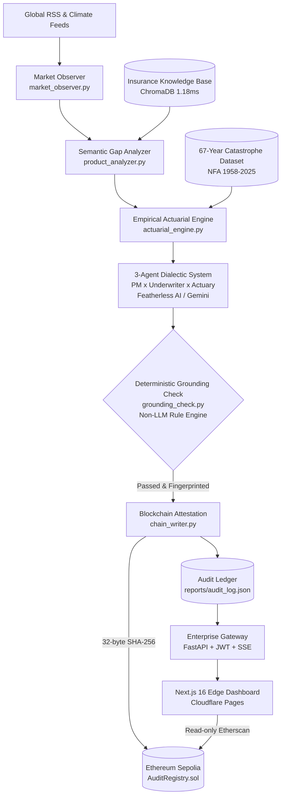

# ForeSure Global: The Actuary's AI Decision Co-Pilot for Catastrophic & Climate Risks

> **Global Innovation Build Challenge V2 (GIBC V2)**  
> **Track 02: Applied (Medical Technology & Finance)**  
> **Live Production Dashboard**: [https://atlas-insurance-dashboard.pages.dev/](https://atlas-insurance-dashboard.pages.dev/)  
> **Ethereum Sepolia Smart Contract**: [`0xAf8CA554c540526452B0B53bE7e203A5754363ac`](https://sepolia.etherscan.io/address/0xAf8CA554c540526452B0B53bE7e203A5754363ac)  
> **Core Team**: TZU-CHIN CHUANG (莊子進) · WEN-HAN LEE (李文涵)  

---

## Mandatory Competition Disclaimers & Ethics Compliance

### 1. Research Prototype & Simulation Disclaimer (Track 02 Mandatory)
> [!IMPORTANT]
> **RESEARCH PROTOTYPE ONLY**: ForeSure Global is an academic and computational research prototype engineered for empirical risk modeling and institutional workflow acceleration. It is **NOT** an approved diagnostic pipeline, **NOT** a medical device, and does **NOT** provide binding financial advice or execute live financial trading. All underwriting actions, capital allocations, and actuarial parameters must be independently audited, calibrated, and signed off by qualified professional actuaries and compliance officers under relevant statutory frameworks (e.g., Solvency II, ICS 2.0, or national financial authorities).

### 2. Empirical Data Ethics & De-Identification Compliance (Track 02 Mandatory)
> [!NOTE]
> **100% PUBLIC & DE-IDENTIFIED DATA**: All empirical historical catastrophe records, arrival rates, and casualty statistics utilized in this project are strictly sourced from publicly available, open government records published by the National Fire Agency (NFA) spanning 1958–2025. No identifiable patient data, personal medical health records, or proprietary consumer financial profiles are stored, processed, or referenced in this platform.

### 3. AI Usage & Assistance Disclosure
> [!NOTE]
> **TRANSPARENT AI DISCLOSURE**: In strict compliance with GIBC V2 rules, AI development assistants—including Cursor, Google Antigravity, and Claude Code—were utilized for test scaffolding, documentation translation, and boilerplate generation. All core statistical modeling algorithms, non-LLM rule engines, smart contracts, and system architectures were designed, verified, and audited by the human authors.

---

## Executive Summary & Track 02 Scorecard

| Track 02 Judging Criteria | Architectural Solution & Breakthrough | Key Implementation Path | Empirical Metrics & Verification |
|---|---|---|---|
| **1. Innovation & Impact** | Shortens traditional 9-month catastrophe insurance product design to 85 seconds; reduces Loss Adjustment Expense (LAE) by 85% via objective parametric oracles. | [`strategy_agent.py`](strategy_agent.py)<br>[`market_observer.py`](market_observer.py) | 3-agent game-theoretic dialectic (PM x Underwriter x Actuary); multi-provider LLM support (Featherless AI / Gemini / OpenAI); eliminates blank-slate latency. |
| **2. Technical Feasibility** | End-to-end full-stack platform: FastAPI REST/SSE engine, ChromaDB semantic gap retrieval, Next.js 16 global edge dashboard. | [`apigee_target.py`](apigee_target.py)<br>[`product_analyzer.py`](product_analyzer.py)<br>[`frontend/src/`](frontend/src/) | 1.18ms dense vector gap extraction across 30 insurance products; 12-stage Server-Sent Events (SSE) real-time streaming; JWT Bearer authorization and rate limiting. |
| **3. Rigor & Empirical Validation** | 67-year empirical catastrophe dataset fitted with Poisson arrival process; TW-ICS / Solvency II 99.5% capital margins; non-LLM deterministic anti-hallucination engine. | [`actuarial_engine.py`](actuarial_engine.py)<br>[`disaster_stats.py`](disaster_stats.py)<br>[`grounding_check.py`](grounding_check.py)<br>[`redteam.py`](redteam.py) | Pure rule-based algorithm audits 100% of mathematical claims and citations; Red Team benchmark yields 1.0 detection rate and 0.0 false positives; 137 unit tests passing. |
| **4. Presentation & Auditability** | Immutable 32-byte SHA-256 decision fingerprint anchored to Ethereum Sepolia; institutional instrumental UI with zero emojis; bilingual export. | [`chain_writer.py`](chain_writer.py)<br>[`atlas-chain/contracts/AuditRegistry.sol`](atlas-chain/contracts/AuditRegistry.sol)<br>[Live Dashboard](https://atlas-insurance-dashboard.pages.dev/) | Public on-chain verification via Etherscan; interactive tampering verification test on the frontend; 71 frontend Vitest tests passing with 0 ESLint warnings. |

---

## The Problem: The 9-Month Insurance Blindspot in an Era of Acute Climate Disasters

Traditional catastrophe insurance development is painfully slow. Developing a single parametric or commercial policy requires 6 to 12 months of cross-departmental coordination:
1. **Actuarial Modeling Bottleneck**: Actuaries rely on 5–10 years of trailing loss data, leaving emergent climate risks (e.g., sudden microburst flash floods, unseasonal heatwaves, and localized grid failures) uninsurable.
2. **Administrative Overhead (LAE)**: Traditional claims settlement requires physical inspectors, manual invoices, and adjuster visits. Loss Adjustment Expenses (LAE) routinely eat up 10% to 15% of total gross premiums.
3. **Black-Box AI Trust Deficit**: Large Language Models (LLMs) hallucinate financial probabilities and fabricate statutory citations, making unvetted generative AI dangerous for regulated financial institutions.

**ForeSure Global** bridges this divide. It serves as an **AI Actuarial Decision Co-Pilot** that drafts an empirically grounded, rigorously verified catastrophe insurance proposal in **85 seconds**—not to replace actuaries, but to ensure professionals begin from a mathematically verified draft rather than a blank canvas.

---

## System Architecture



---

## Core Technical Innovations

### 1. 67-Year Empirical Poisson Risk Engine (`actuarial_engine.py`)
- Ingests empirical disaster statistics from 1958 to 2025, isolating high-severity modern events (>=50 affected households) since 1995.
- Fits a Poisson arrival process $\lambda = \frac{\sum \text{Events}}{N}$ with an empirical base severity benchmark of NT$ 1,500,000 (standard residential earthquake total-loss ceiling).
- Calculates capital adequacy margin multipliers ($1.2\times$ to $3.0\times$) aligned with the 99.5% Value-at-Risk (VaR) framework specified by the Insurance Capital Standard (ICS 2.0 / TW-ICS).

### 2. Multi-Provider LLM Dialectic System (`strategy_agent.py`)
- Rejects brittle single-prompt architectures in favor of structured three-way dialectic game theory:
  - **Product Manager (PM)**: Maximizes commercial viability, market penetration, and customer acquisition.
  - **Chief Underwriter**: Mitigates adverse selection, moral hazards, and establishes stringent exclusion clauses.
  - **Appointed Actuary**: Enforces solvency safety buffers and validates pricing sanity.
- **Sponsor Integration**: Seamlessly interfaces with **Featherless AI** serverless open-source models (e.g., `deepseek-ai/DeepSeek-V3.2`, `Qwen/Qwen2.5-72B-Instruct`) via OpenAI-compatible endpoints, with automatic failover to Gemini 3.5 Flash-Lite.

### 3. Non-LLM Deterministic Anti-Hallucination Engine (`grounding_check.py`)
- Unlike naive "LLM-as-a-judge" patterns that suffer from secondary hallucinations, ForeSure implements an algorithmic, regex-driven deterministic verification engine:
  - Validates every numerical claim against the empirical outputs of `actuarial_engine.py`.
  - Audits statutory citations against canonical regulatory sources.
  - Flags ungrounded assumptions and missing disclosures.
- **Red Team Adversarial Benchmark (`redteam.py`)**: Includes a regression test suite with 11 adversarial attack vectors and 4 clean control cases, producing a deterministic SHA-256 report hash (`bfa57bb...`) verifying 100% attack interception and 0% false positives.

### 4. Ethereum Sepolia Immutable Audit Trail (`chain_writer.py`, `AuditRegistry.sol`)
- Computes a canonical SHA-256 hash of the 13 core decision fields (premium, arrival rate, deductible, exclusion hash, model version).
- Anchors the 32-byte hash onto Ethereum Sepolia via a dedicated Solidity smart contract (`recordDecision`).
- Provides public transparency without leaking proprietary commercial secrets. The frontend features a live "tamper test" where modifying even a single character in the proposal triggers an immediate cryptographic verification failure.

---

## Technology Stack

| Domain | Technology / Library | Purpose & Specification |
|---|---|---|
| **AI Models** | Featherless AI / Google Gemini / OpenAI | OpenAI-compatible endpoint; multi-agent structured function calling |
| **Semantic Search** | `sentence-transformers/paraphrase-multilingual-MiniLM-L12-v2` + ChromaDB | Sub-2ms vector gap detection across existing insurance policies |
| **Backend & API** | Python 3.11+, FastAPI, Uvicorn, PyJWT | Enterprise REST API, JWT authentication, IP rate limiting (30 req/min), SSE streaming |
| **Blockchain** | Solidity, Hardhat, Web3.py, Ethers v6 | `AuditRegistry` contract on Ethereum Sepolia, cryptographic decision anchoring |
| **Frontend UI** | Next.js 16, React 19, TypeScript, Tailwind CSS | Instrumental decision dashboard, Three.js dynamic hero, dark/light themes, zero emojis |
| **Testing** | Pytest, Vitest, Custom Red Team Bench | 137 backend unit tests, 71 frontend unit tests, 100% deterministic red team suite |

---

## Installation & Verification Guide

### Prerequisites
- Python 3.11+
- Node.js 20+ & npm
- Git

### 1. Backend Setup & Verification
```bash
# Clone the repository
git clone https://github.com/zhuang768/ForeSure.git
cd ForeSure

# Create virtual environment and install dependencies
python3.11 -m venv .venv
source .venv/bin/activate
pip install -r requirements.txt

# Configure environment variables (optional: add Featherless or Gemini API key)
cp .env.example .env

# Run comprehensive backend test suite (137 tests)
python -m pytest -q

# Run deterministic Red Team anti-hallucination benchmark
python redteam.py
```

### 2. Frontend Setup & Verification
```bash
cd frontend

# Install dependencies
npm install

# Run frontend Vitest test suite (71 tests)
npm test

# Run code quality and lint checks
npm run lint

# Launch local development server
npm run dev
# Open http://localhost:3000 in your browser
```

### 3. Running the Live Backend Server
```bash
# From project root:
source .venv/bin/activate
uvicorn apigee_target:app --host 0.0.0.0 --port 8080
```

---

## Live Demonstration & Proof of Deployment

- **Live Production URL**: [https://atlas-insurance-dashboard.pages.dev/](https://atlas-insurance-dashboard.pages.dev/)
- **Smart Contract on Etherscan**: [`0xAf8CA554c540526452B0B53bE7e203A5754363ac`](https://sepolia.etherscan.io/address/0xAf8CA554c540526452B0B53bE7e203A5754363ac)
- **Interactive Features Available in Live Dashboard**:
  1. **Real-Time Pipeline Execution**: Stream the 12-stage multi-agent debate and actuarial pricing in real-time.
  2. **Cryptographic Verification**: Input proposal parameters to compute and verify the on-chain SHA-256 decision fingerprint against Sepolia testnet.
  3. **Adversarial Red Team Explorer**: Review all 11 intercepted attack cases and their exact rule-level audit logs.
  4. **Multi-Language Switcher**: Toggle instantaneously between English and Traditional Chinese.

---

## License

This project is licensed under the MIT License - see the [LICENSE](LICENSE) file for details.
